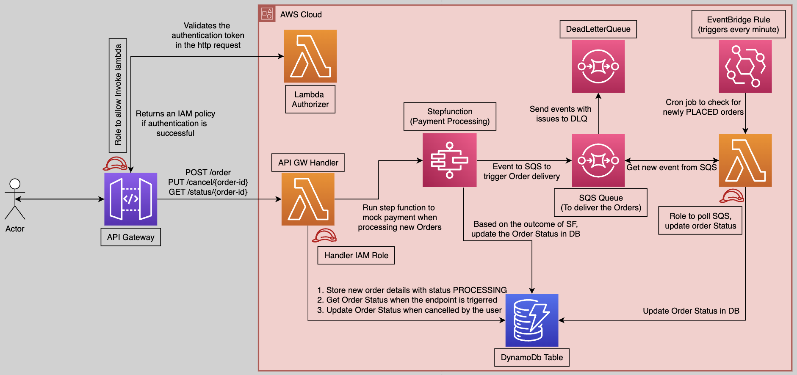

# Challenge 3

### Folder Structure:
```
challenge3/
  content/
    - get_item.py -> python script to return a value for a given key
    - test_get_item.py -> unit tests
  requirements.txt
```

### Steps to run unit tests locally:
1. cd to the root folder containing the challenges
   
2. Setup python virtual environment:
   ```bash
   ➜  python3 -m venv .venv
   ➜  source .venv/bin/activate
   (.venv) ➜  pip install -r challenge3/requirements.txt 
   ```
    
3. Set PYTHONPATH:
   ```bash
   (.venv) ➜  export PYTHONPATH=./challenge3 
   ```
    
4. Run unit tests:
   ```bash
   (.venv) ➜  pytest -x challenge3/content
   ```
&nbsp;
&nbsp;

# Challenge 2

#### Took reference from https://docs.aws.amazon.com/AWSEC2/latest/UserGuide/instancedata-data-retrieval.html

### Folder Structure:
```
challenge2/
  content/
    - index.py -> python script to return a value for a given key
    - tests/   -> unit tests
      - conftest.py
      - payload.py
      - test_index.py
  requirements.txt
```

### Steps to run unit tests locally:
1. cd to the root folder containing the challenges
   
2. Setup python virtual environment:
   ```bash
   ➜  python3 -m venv .venv
   ➜  source .venv/bin/activate
   (.venv) ➜  pip install -r challenge2/requirements.txt 
   ```
    
3. Set PYTHONPATH:
   ```bash
   (.venv) ➜  export PYTHONPATH=./challenge2 
   ```
    
4. Run unit tests:
   ```bash
   (.venv) ➜  pytest -x challenge2/content
   ```

### How to use the python script to get instance metadata?

<b>Note</b>: For the script to work, it should be executed in the EC2 machine.

1. cd to the root folder containing the challenges
   
2. Setup python virtual environment:
   ```bash
   ➜  python3 -m venv .venv
   ➜  source .venv/bin/activate
   (.venv) ➜  pip install -r challenge2/requirements.txt 
   ```
    
3. Set PYTHONPATH:
   ```bash
   (.venv) ➜  export PYTHONPATH=./challenge2 
   ```

4. Execute script:
   ```bash
   (.venv) ➜  cd challenge2/content
   (.venv) ➜  python index.py
   (.venv) ➜  {"ami-id": "", "ami-launch-index": 0, "ami-manifest-path": "(unknown)", "block-device-mapping": {"ami": "/dev/xvda", "root": "/dev/xvda"}, "events": {"maintenance": {"history": [], "scheduled": []}}, "hostname": ".........", "services": {"domain": "amazonaws.com", "partition": "aws"}, "system": "xen"}
   (.venv) ➜  python index.py ami-launch-index
   0
   (.venv) ➜  python index.py system
   xen
   (.venv) ➜  python index.py block-device-mapping/
   {"ami": "/dev/xvda", "root": "/dev/xvda"}
   # You can also pass -h pr --help as an argument to the script:
   (.venv) ➜  python index.py --help

   This script prints the instance metadata.
   You can either get complete metadata or provide a path as argument to fetch a specific key.

   For example:
    To fetch the full metadata run: `python ./index.py`
    To fetch the value of http://169.254.169.254/latest/meta-data/<path>, run: `python ./index.py <path>`

   ```

### Note: 

1. Please take care of using "/" if you want to fetch the value of specifc key that points to a dictionary. For example:
   ```bash
   (.venv) ➜  python index.py block-device-mapping
   ami
   root
   (.venv) ➜  python index.py block-device-mapping/
   {"ami": "/dev/xvda", "root": "/dev/xvda"}
   ```


&nbsp;
&nbsp;

# Challenge 1 (Order Management API)

For the 3 tier architecture, I've tried to implement an Order Management System. There are 3 endpoints provided by the API:
### POST /order
This endpoints expects a json body which consists of 
1. "Item": Required, type String
2. "Amount": Required, type Int
3. "Description": Optional, type String
### GET /order/{order-id}
This endpoint shows the current status of the Order-id provided by the user
### PUT /cancel/{order-id}
This endpoint cancels an order based on some condition.

## Order LifeCycle
1. When a new Order is placed, its status is <b>PROCESSING</b>
2. The lambda handler for the API Gateway, triggers a step function which represents the payment process.
3. If the Payment Processing Step function is executed succesfully, the Order status changes to <b>PLACED</b>, otherwise its set to FAILED
4. After the Order is <b>PLACED</b>, it is transferred to an SQS Queue, this represnts the delivery part of the order life cycle
5. An Event Bridge Rule is in place, that triggers a lambda function at 1 minute interval to fetch events from the Queue.
6. The Lambda function processes the event, changes the Order Status to <b>IN_TRANSIT</b> and removes it from the Queue
7. While this is happening, if the /cancel/{order-id} is executed, it will change the order Status to <b>CANCELLED</b>.
8. The final state of an Order will be <b>CANCELLED</b> or <b>COMPLETED</b>




### Folder Structure:
```
challenge1/
  src/
    - lambda/ -> folder containing the lambda functions and rest api
      - /restapi -> folder containing api deployed using chalice
    - layers/ -> folder containing common layer used by lambda
      - common/ -> folder containing the common python modules (for layers)
      - requirements.txt -> dependent python packages for layers
  stacks/ -> folder containing the cloudformation stacks
  app.py -> file containing cdk app definition
  requirements.txt -> requirements file for local developement
```
### Steps to synthesize the stack locally
1. cd to the root folder containing the challenges
   
2. Setup python virtual environment:
   ```bash
   ➜  python3 -m venv .venv
   ➜  source .venv/bin/activate
   (.venv) ➜  pip install -r challenge1/requirements.txt 
   ```
    
3. Set PYTHONPATH:
   ```bash
   (.venv) ➜  export PYTHONPATH=./challenge1/src/layers
   ```
    
4. cdk deploy/synth using the aws profile configured locally:
   ```bash
   (.venv) ➜  cd challenge1/
   # To synthesise the cloudformation stack on your local machine
   (.venv) ➜  cdk synth --profile <your-aws-profile>
   # To deploy the cloudformation stack on your aws account
   (.venv) ➜  cdk deploy --profile <your-aws-profile>
   ```

5. cdk deploy/synth using Environment Variables:
   ```bash
   (.venv) ➜ export AWS_ACCESS_KEY_ID=<YOUR-ACCESS-KEY>
   (.venv) ➜ export AWS_SECRET_ACCESS_KEY=<YOUR-SECRET-ACCESS-KEY>
   (.venv) ➜ export AWS_DEFAULT_REGION=<YOUR-DEPLOYMENT-REGION>
   (.venv) ➜  cd challenge1/
   # To synthesise the cloudformation stack on your local machine
   (.venv) ➜  cdk synth
   # To deploy the cloudformation stack on your aws account
   (.venv) ➜  cdk deploy
   ```